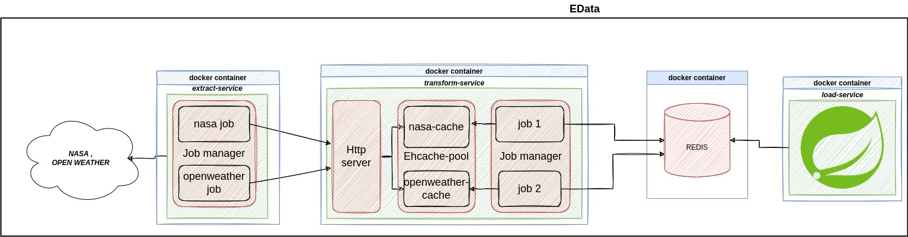

# EData

## Introduction

An simple prototype ELT app for data about earth from different data providers.

## Technology Stack

1. Java 11
2. Jackson
3. Slf4j
4. JUnit5 & Testcontainers & AssertJ
5. Ehcache
6. Lombok & Mapstruct
7. Apache (Commons,HttpCore, HttpClient)
8. Jedis
9. Lettuce.io
10. Spring boot
11. Spring data redis
12. Maven
13. Docker

## Architecture



### SETUP

<br>1. Install docker & docker compose locally

### TO RUN

```
docker compose up -d
```
